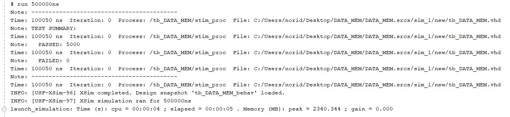
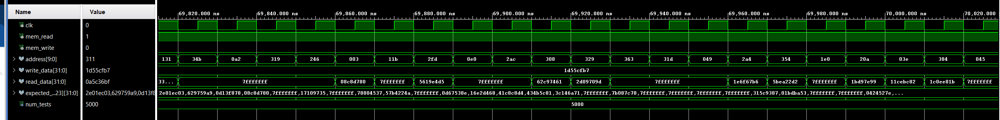
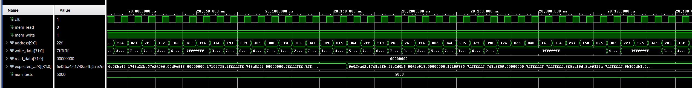

# DATA_MEM - 32-bit Word-Addressable Data Memory in VHDL

## Overview

This module implements a synchronous, word-addressable data memory unit in VHDL. The design supports 1024 memory locations, each 32 bits wide, and provides separate control signals for read and write operations. The included testbench uses randomized addresses and data to verify correct behavior across 5000 transactions.

## Features

- 1024 × 32-bit word memory (4 KB total)
- Synchronous write on rising clock edge
- Combinational read with `mem_read` control
- Addressable via 10-bit input
- Fully verified with randomized testbench
- Readable hexadecimal output using reusable function package

## Project Structure
**DATA_MEM**/
- images/
    - tcl.png, wave_memread.png, wave_memWrite.png
- src/
    - DATA_MEM.vhd, reusable_function.vhd, function_definition.vhd
- test_benches/
    - tb_DATA_MEM.vhd
- .gitignore
- README.md

## Interface

### Entity: `DATA_MEM`

| Port        | Direction | Width               | Description                         |
|-------------|-----------|----------------------|-------------------------------------|
| `clk`       | in        | 1 bit               | System clock (rising-edge write)    |
| `mem_read`  | in        | 1 bit               | Enables reading from memory         |
| `mem_write` | in        | 1 bit               | Enables writing to memory           |
| `address`   | in        | 10 bits             | Word-aligned memory address (0–1023)|
| `write_data`| in        | 32 bits             | Data to write                       |
| `read_data` | out       | 32 bits             | Data read from memory               |

## Testbench Strategy

- Uses `uniform()` with fixed seeds for reproducible random behavior
- Randomized address and data generation
- Writes values during `mem_write = '1'` on rising clock edge
- Reads values when `mem_read = '1'` and compares against expected
- Built-in `assert` to halt on mismatched read
- Tracks pass/fail count and prints final test summary

## Simulation Results
### Tcl Console Output
  
*5000 randomized read/write tests passed with zero failures. All memory accesses were within bounds and verified.*
---
### Waveform: Memory Read
  
*Waveform shows correct behavior: when `mem_read = '1'`, `read_data` immediately reflects the contents of the specified address.*
---
### Waveform: Memory Write
  
*Waveform confirms that writes occur only on the rising edge of `clk`, and only when `mem_write = '1'`. `write_data` and `address` are stable at the edge.*

## Key Learnings

- Understood how to implement synchronous write and combinational read in VHDL
- Learned that `std_logic_vector` must be converted to integer using `to_integer(unsigned(...))` for memory indexing
- Realized the importance of guarding against edge cases like out-of-range addresses and integer overflow
- Used `mod` with randomly generated addresses to avoid index errors
- Discovered how `to_unsigned(...)` acts as a safe clamp for large integers during data generation
- Gained experience reading and interpreting waveform behavior, including rising edge timing and delta delays
- Practiced debugging with the TCL console and added runtime assertions for memory correctness

## How to Run
1. Launch **Vivado 2019** or newer
2. Open the project or create a new one and add the src and a test bench file.
3.  Set `tb_DATA_MEM.vhd` as the top-level simulation unit.
4. Run the simulation:
    - Go to Flow → Run Simulation → Run Behavioral Simulation
    - Or use the project manager's simulation shortcut.
    - Increase the simulation runtime if needed to capture full behavior.
5. View signals in the Waveform Viewer and test status in the Tcl Console.

## Author
**Noridel Herron** (@MIZZOU)  
Senior in Computer Engineering  
noridel.herron@gmail.com

## Contributing
This is a personal academic project. Suggestions, issues, and improvements are welcome through GitHub.

## License
MIT License

## Disclaimer
This project is developed solely for educational and personal learning purposes.  
It may contain unfinished or experimental features and is not intended for commercial or production use.